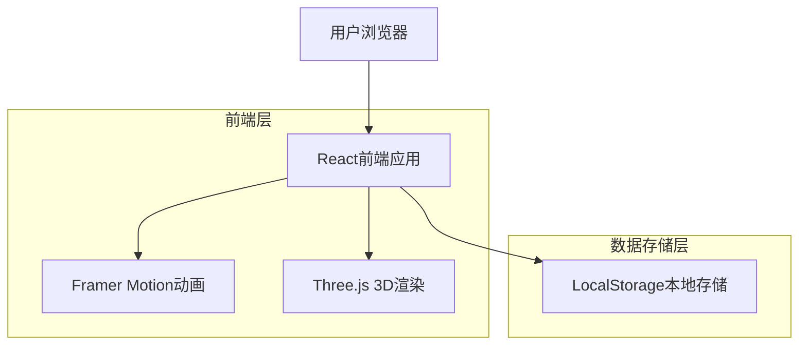

## 1. 架构设计



## 2. 技术描述

- **前端**: React@18 + TypeScript@5 + Vite
- **样式**: Tailwind CSS@3 + 自定义多巴胺配色方案
- **动画**: Framer Motion@10 - 用于页面过渡和交互动画
- **3D渲染**: Three.js@0.158 + @react-three/fiber@8 - 存钱罐3D可视化
- **状态管理**: React Hooks (useState, useEffect, useContext)
- **数据存储**: LocalStorage API - 用户数据本地持久化
- **初始化工具**: vite-init
- **后端**: 无 - 纯前端应用

## 3. 路由定义

| 路由 | 用途 |
|------|------|
| / | 仪表盘页面 - 应用主页，显示今日预算和存钱罐状态 |
| /calendar | 日历页面 - 查看历史记录和数据统计 |
| /settings | 设置页面 - 配置预算参数和管理固定支出 |

## 4. 数据模型

### 4.1 TypeScript接口定义

```typescript
// 用户设置接口
interface UserSettings {
  monthlyBudget: number;          // 月度预算
  fixedExpenses: {              // 固定支出列表
    amount: number;               // 支出金额
    label: string;                // 支出标签（如：房租、水电费）
  }[];
  currentPiggyBankLevel: number; // 当前存钱罐等级
  createdAt: string;             // 创建时间
  updatedAt: string;              // 更新时间
}

// 交易记录接口
interface Transaction {
  id: string;                    // 唯一标识符
  date: string;                  // 交易日期（YYYY-MM-DD格式）
  amount: number;                // 交易金额（支出为正数）
  tags: ('essential' | 'fixed' | 'optional')[]; // 标签数组
  note?: string;                  // 备注（可选）
  createdAt: string;             // 创建时间
}

// 存钱罐状态接口
interface PiggyBankState {
  currentAmount: number;          // 当前金额
  capacityLevel: number;          // 容量等级（30、50、100、200...）
  totalSavedHistory: number;      // 历史总储蓄金额
  lastUpgradedAt?: string;        // 上次升级时间
}

// 日储蓄计算结果接口
interface DailySavings {
  date: string;                  // 日期
  dailyBudget: number;           // 日预算
  totalExpenses: number;          // 总支出
  savings: number;               // 储蓄金额（负值表示超支）
  isPositive: boolean;           // 是否为正储蓄
}
```

### 4.2 本地存储结构

```typescript
// LocalStorage键名定义
const STORAGE_KEYS = {
  USER_SETTINGS: 'jieyou_user_settings',
  TRANSACTIONS: 'jieyou_transactions',
  PIGGY_BANK_STATE: 'jieyou_piggy_bank_state',
  APP_VERSION: 'jieyou_app_version'
} as const;
```

## 5. 核心算法逻辑

### 5.1 日预算计算公式
```typescript
function calculateDailyBudget(monthlyBudget: number, fixedExpenses: number[], daysInMonth: number): number {
  const totalFixedExpenses = fixedExpenses.reduce((sum, expense) => sum + expense, 0);
  const remainingBudget = monthlyBudget - totalFixedExpenses;
  return Math.max(0, remainingBudget / daysInMonth);
}
```

### 5.2 储蓄计算逻辑
```typescript
function calculateSavings(dailyBudget: number, dailyExpenses: number): number {
  const savings = dailyBudget - dailyExpenses;
  return savings > 0 ? savings : 0; // 负储蓄不计入存钱罐
}
```

### 5.3 存钱罐升级规则
```typescript
const PIGGY_BANK_LEVELS = [30, 50, 100, 200, 500, 1000, 2000, 5000, 10000];

function getNextLevel(currentLevel: number): number {
  const currentIndex = PIGGY_BANK_LEVELS.indexOf(currentLevel);
  return currentIndex < PIGGY_BANK_LEVELS.length - 1 
    ? PIGGY_BANK_LEVELS[currentIndex + 1]
    : currentLevel;
}
```

## 6. 组件架构

### 6.1 主要React组件
- **DashboardPage**: 仪表盘主页面
- **CalendarPage**: 日历和统计页面
- **SettingsPage**: 设置页面
- **PiggyBank3D**: 3D存钱罐组件
- **BudgetCard**: 预算显示卡片
- **TransactionInput**: 交易输入组件
- **CalendarGrid**: 日历网格组件
- **StatisticsChart**: 统计图表组件

### 6.2 自定义Hooks
- **useUserSettings**: 管理用户设置状态
- **useTransactions**: 管理交易记录
- **usePiggyBank**: 管理存钱罐状态
- **useDailySavings**: 计算日储蓄金额

## 7. 性能优化策略

- **懒加载**: 使用React.lazy对日历和设置页面进行代码分割
- **记忆化**: 使用useMemo缓存复杂计算结果
- **本地存储优化**: 实现数据压缩和定期清理机制
- **动画优化**: 使用will-change CSS属性和GPU加速

## 8. 浏览器兼容性

- **支持浏览器**: Chrome 90+, Firefox 88+, Safari 14+, Edge 90+
- **必需特性**: LocalStorage, ES6+, CSS Grid, SVG
