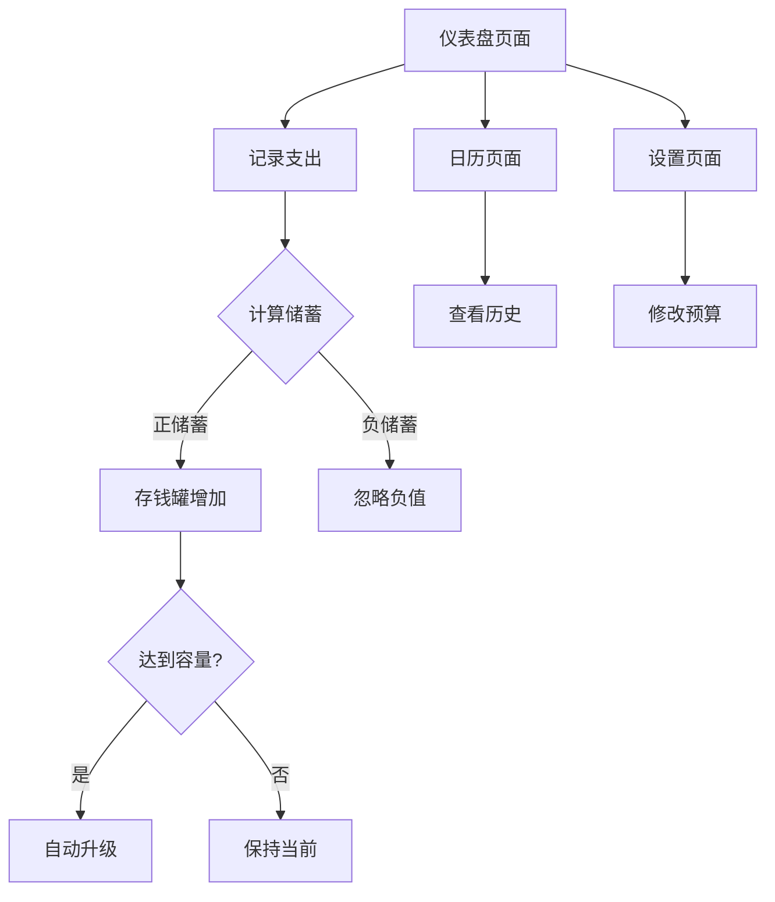

## 1. 产品概述
JIEYOU存钱罐是一款帮助用户养成储蓄习惯的趣味化Web应用。通过游戏化的预算管理和自动升级的存钱罐机制，让用户在轻松愉快的氛围中实现理财目标。

- 解决年轻人储蓄意识薄弱、缺乏理财动力的问题
- 面向18-35岁注重生活品质的年轻用户群体
- 通过可视化进度和成就系统，让储蓄变得有趣且有成就感

## 2. 核心功能

### 2.1 用户角色
本产品为单用户应用，无需区分用户角色。所有功能面向同一用户开放。

### 2.2 功能模块
JIEYOU存钱罐包含以下核心页面：
1. **仪表盘页面**：今日预算状态、存钱罐可视化、快速记账入口
2. **日历页面**：历史记录查看、每日详情、数据统计
3. **设置页面**：预算配置、固定支出管理、存钱罐等级查看

### 2.3 页面详情
| 页面名称 | 模块名称 | 功能描述 |
|---------|---------|----------|
| 仪表盘页面 | 今日预算卡片 | 显示今日可用预算、已花费金额、剩余金额，使用进度条可视化展示 |
| 仪表盘页面 | 存钱罐可视化 | SVG存钱罐组件，使用CSS高度/颜色过渡模拟被填满的效果，满罐时播放升级动画 |
| 仪表盘页面 | 快速记账 | 输入花费金额、选择标签、添加备注，一键记录今日支出 |
| 仪表盘页面 | 今日储蓄显示 | 显示今日已储蓄金额，使用多巴胺配色突出正向激励 |
| 日历页面 | 月历视图 | 以日历形式展示每日支出和储蓄情况，不同颜色区分盈亏状态 |
| 日历页面 | 统计图表 | 柱状图展示本月每日储蓄趋势，折线图显示支出变化 |
| 日历页面 | 详情弹窗 | 点击日期查看当日所有交易记录和储蓄详情 |
| 设置页面 | 预算设置 | 设置月度预算金额，自动计算每日可用预算 |
| 设置页面 | 固定支出管理 | 添加、编辑、删除固定支出项目（房租、水电等） |
| 设置页面 | 存钱罐等级 | 显示当前存钱罐容量等级和升级历史记录 |
| 设置页面 | 数据管理 | 导出数据、重置应用、使用说明查看 |

## 3. 核心流程

### 主要用户操作流程：
1. **首次使用流程**：用户首次进入应用 → 设置月度预算和固定支出 → 查看今日预算 → 开始记录支出 → 观察储蓄进度
2. **日常使用流程**：打开应用 → 查看今日剩余预算 → 记录支出 → 查看储蓄结果 → 观察存钱罐状态
3. **存钱罐升级流程**：储蓄金额达到当前容量 → 触发升级动画 → 自动扩容到下一等级 → 历史储蓄总额累积

## 4. 用户界面设计

### 4.1 设计风格
- **主色调**：多巴胺配色方案
  - 主色：活力橙 (#FF6B35) - 代表储蓄的正向激励
  - 辅助色：薄荷绿 (#00D9A3) - 代表成功和成就
  - 强调色：亮黄色 (#FFD93D) - 用于重要按钮和提示
  - 中性色：暖灰色 (#F5F5F5) - 背景和卡片底色
- **按钮样式**：大圆角设计（border-radius: 16px），带有微妙阴影效果
- **字体选择**：主标题使用加粗的圆体字体，正文使用清晰的无衬线字体
- **布局风格**：卡片式布局，大量使用圆角和留白，营造轻松氛围
- **图标风格**：使用圆润的线性图标，搭配emoji表情增加趣味性

### 4.2 页面设计概述
| 页面名称 | 模块名称 | UI元素 |
|---------|---------|--------|
| 仪表盘页面 | 预算卡片 | 渐变色背景，大字体显示剩余预算，圆形进度条使用薄荷绿到橙色的渐变 |
| 仪表盘页面 | 存钱罐区域 | 居中放置的SVG存钱罐，使用CSS transition实现水位上升效果，支持Framer Motion交互动画 |
| 仪表盘页面 | 记账输入 | 大号数字键盘样式，圆角输入框，标签使用彩色胶囊形状按钮 |
| 日历页面 | 月历网格 | 简洁的网格布局，日期数字使用不同颜色：绿色表示储蓄日，红色表示超支日 |
| 日历页面 | 统计图表 | 使用Framer Motion实现平滑的动画效果，柱状图使用渐变色填充 |
| 设置页面 | 设置项 | 大图标+文字的组合，开关使用iOS风格的滑动开关 |

### 4.3 响应式设计
- **桌面优先**：默认设计为桌面端使用，最大宽度限制为1200px
- **移动端适配**：在768px以下屏幕，自动切换为单列布局
- **触摸优化**：按钮最小高度为48px，确保移动端易于点击

### 4.4 动画效果
- **页面切换**：使用Framer Motion实现平滑的页面过渡动画
- **数字变化**：金额变化时使用数字滚动动画效果
- **存钱罐升级**：播放金币飞入和容量扩大的组合动画
- **成功反馈**：记录储蓄时显示+1的浮动动画